<div align="center">

# 👋 Hey, I'm LostXRP

### Cybersecurity • Developer • Crypto & Web3

I build tools that solve real problems, spanning cybersecurity, software development, automation, and blockchain technology.

</div>

---

<h2 align="center">🤓 Stats For Nerds</h2>

<p align="center">
  
</p>

<p align="center">
  
  
</p>

---

<h2 align="center">💻 About Me</h2>

```python
from github import Readme


class LostXRP(Readme):
    def __init__(self):
        self.name = "LostXRP"
        self.github = "@LostXRP"
        self.interests = [
            "Cybersecurity",
            "Software Development",
            "Automation",
            "Blockchain",
            "Solana",
            "Web3",
        ]

    def currently_building(self):
        return "Something interesting..."
```

---

<h2 align="center">🛠️ Languages & Tools</h2>

<h3 align="center">Languages</h3>

<p align="center">
  
  
  
  
  
  
</p>

<h3 align="center">Development & Infrastructure</h3>

<p align="center">
  
  
  
  
  
  
  
  
  
</p>

<h3 align="center">Web3 & Crypto</h3>

<p align="center">
  
  
  
  
</p>

<h3 align="center">Platforms & Workflow</h3>

<p align="center">
  
  
  
</p>

---

<h2 align="center">🔐 Cybersecurity Focus</h2>

```text
> Security Research
> OSINT
> Networking
> Privacy & OPSEC
> Python-based Automation
```

---

<h2 align="center">⛓️ Web3 Focus</h2>

```text
> Solana Development
> On-Chain Analytics
> Trading Tools
> Crypto APIs
```

---

<h2 align="center">📊 Activity</h2>

<p align="center">
  
</p>

<h3 align="center">🐍 Contribution Snake</h3>

<p align="center">
  
</p>

---

<div align="center">

### 🕷️ Build. Break. Learn. Repeat.

</div>
